# 🏝️ 여름 휴가 여기 어때?

## 🚀 프로젝트 소개

### **개발 동기**

누구나 쉽고 빠르게 숙소를 검색하고 예약할 수 있도록 돕기 위해 개발했습니다.

### **주요 기능**

숙소 검색, 예약, 후기 작성, 찜하기 등 숙소 예약에 필요한 기본적인 기능을 제공합니다.

### **특징 및 차별점**

검색어 자동 저장과 인기 검색어 조회 기능으로 사용자 편의를 높였고, Redis 캐시를 활용해 빠른 검색을 지원합니다. 또한 안정적인 예약 처리를 위해 분산 락도 도입했습니다.


## 👤 팀원

- 이름 (역할)
    - 한승수
        - 팀장 / 예약, 찜하기 기능(Redis Cache)
    - 구대웅
        - 숙소 조회 및 검색 기능 (QueryDSL + Redis Cache), 데이터 동기화 문제
    - 김두하
        - 유저, Spring Security, 동시성 제어 기능
    - 우새빛
        - 검색어 저장 AOP, 인기 검색어 조회 기능
    - 이시온
        - 후기 기능
    - 차순영
        - 숙소 등록, 수정, 삭제 기능
    


## 🗓️ 진행 기간

- 2025.07.08 ~ 2025.07.14


## ⚙️ 개발 환경

- `Java 17`
- `Spring Boot 3.5.3`
- `IntelliJ IDEA`
- `Gradle 8`
- `MySQL 8.0.33`
- `QuertyDSL 5.1.0 (Jakarta)`
- `Spring Security 6.5.1 + JWT`
- `Lombok`
- `Spring Cache, Redis`
- `Postman`
- `nGinder, jmeter`


## 📌 주요 기능

- 유저 CRUD
    - 회원 가입, 로그인, 내 정보 조회, 회원 탈퇴
- 숙소 CRUD
    - 등록, 수정, 삭제
- 숙소 검색
    - 키워드 / 지역 검색 (QueryDSL + Redis Cache)
    - 데이터 동기화 이슈 해결
- 인기 검색어 조회
- 예약 CRUD
    - 생성, 조회, 수정, 취소
- 후기 CRUD
    - 작성, 조회, 수정, 삭제
- 찜하기
    - 찜 목록 조회, 취소


## ✏️ 와이어 프레임

- 와이어프레임 이미지
    
    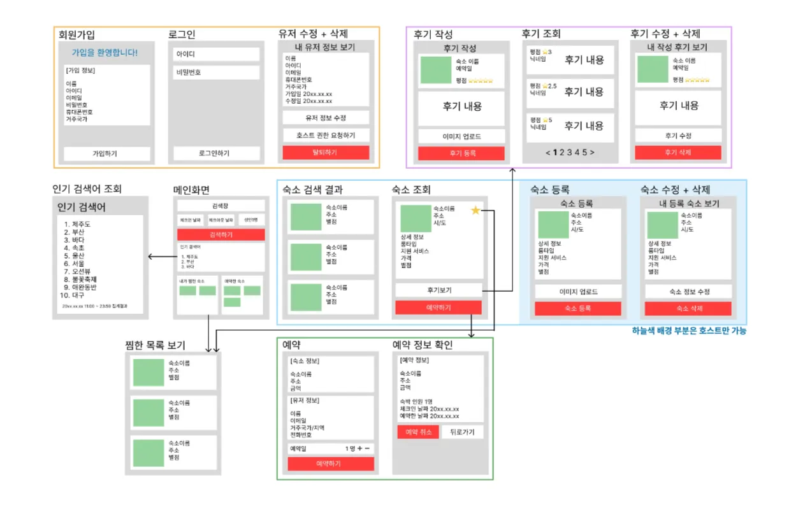
    


## 📏 ERD

- ERD 이미지
    
    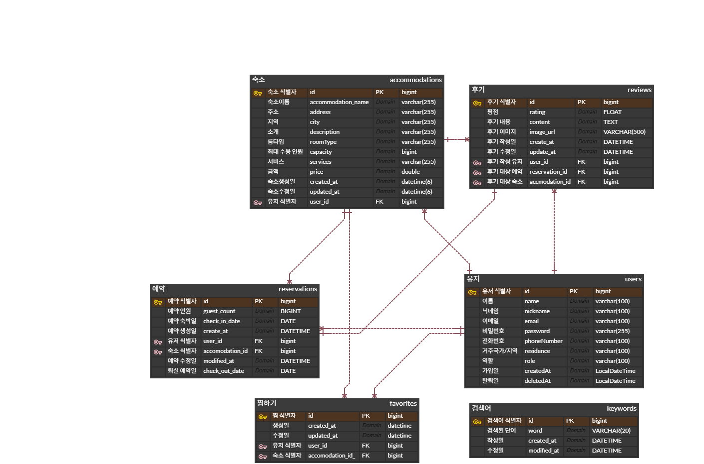
    


## 📘 API 엔드포인트

🔗 [Postman API 명세서 바로가기](https://documenter.getpostman.com/view/44682451/2sB34hEzdY)

| Domain | Method | Endpoint | Description |
| --- | --- | --- | --- |
| Auth | POST | /api/auth/signup | 회원 가입 |
| Auth | POST | /api/auth | 로그인 |
| User | PUT | /api/users/{userId} | 사용자 역할 변경 |
| User | GET | /api/users/me | 현재 사용자 정보 조회 |
| User | DELETE | /api/users/{userId} | 회원 탈퇴 |
| Accommodation | POST | /api/accommodations | 숙소 생성 |
| Accommodation | GET | /api/accommodations/v3/search/keyword | 숙소 키워드 검색 |
| Accommodation | GET | /api/accommodations/v3/search/city | 숙소 지역 검색 |
| Trending | GET | /api/trending | 인기 검색어 조회 |
| Accommodation | PATCH | /api/accommodations/{accommodationsId} | 숙소 수정 |
| Accommodation | DELETE | /api/accommodations/{accommodationsId} | 숙소 삭제 |
| Accommodation | POST | /api/reservations | 숙소 예약 |
| Reservation | GET | /api/reservations | 예약 목록 조회 |
| Reservation | PATCH | /api/reservations/{reservationsId} | 예약 인원 변경 |
| Reservation | DELETE | /api/reservations/{reservationsId} | 예약 취소 |
| Review | POST | /api/reviews | 후기 작성 |
| Review | GET | /api/reviews/{reviewId} | 후기 단건 조회 |
| Review | GET | /api/reviews | 후기 전체 조회 |
| Review | PATCH | /api/reviews/{reviewId} | 후기 수정 |
| Review | DELETE | /api/reviews/{reviewId} | 후기 삭제 |
| Favorite | POST | /api/favorites/{accommodationId} | 찜하기 |
| Favorite | GET | /api/favorites | 찜 목록 조회 |
| Favorite | DELETE | /api/favorites/{favoriteId} | 찜 취소하기 |


## ⚡️ 캐시 (성능 개선)

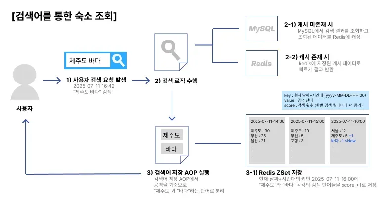

- 테스트 대상: 숙소 조회 API (like를 이용한 숙소 이름 & 주소 탐색)
- 테스트 환경

| 항목 | 값 |
| --- | --- |
| 총 데이터 수 | 1,050,011 개 |
| 검색 데이터 | 50,001 개 |
| 사용자 수 | 300명 |
| Ramp-up | 30초 |
| 루프 카운트 | 5회 반 |
| 비교 대상 | V1(QueryDSL) / V3(QueryDSL + RedisCache) |
- 결과 요약

| 지표 | V1 (QueryDSL) | V3 (QueryDSL + Redis Cache) | 개선 효과 |
| --- | --- | --- | --- |
| 평균 응답 시간 | 42,167ms | 609ms | 약 69배 개선 |
| 최고 응답 시간 | 56,295ms | 18,687ms | 약 3배 개선 |
| 오류율 | 55.33% | 0% | 오류 제거 |
| 처리량 | 5.9sec | 50.1sec | 약 8.5배 증가 |

### 1. 요청을 보낸 시점부터 서버가 첫 번째 응답 바이트를 보내기까지 걸린 시간

[V1]

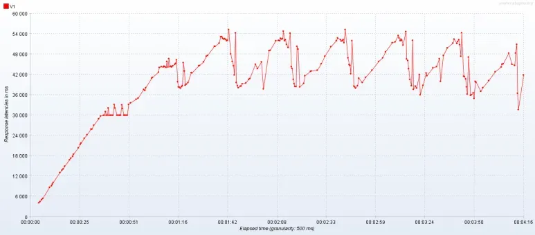

 [V3]

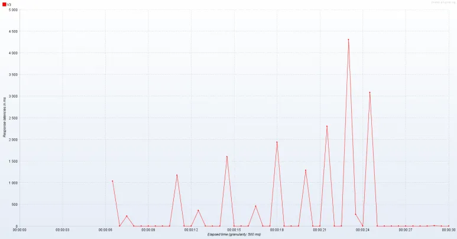

(X: 시간 경과, Y: 응답 지연 시간)

- 결과
    - V1 : 소요시간 4:16s, 매우 불안정함
    - V3 : 소요시간 30s, 안정적임

### 2. 단위 시간(1초) 동안 서버가 처리한 요청 수

[V1]

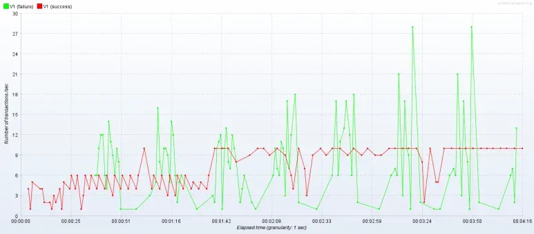

초록: 실패, 빨강: 성공

[V3]

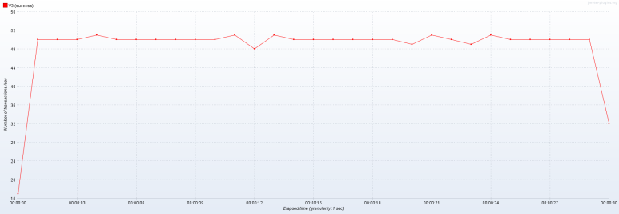

- 결과
    - V1 : 성공 요청 처치량 평균 8 TPS, 최고 12 TPS,  실패율 높음
    - V3 : 성공 요청 처치량 평균 60 TPS, 최고 100 TPS,  실패 없음

### 3. 시간 경과에 따라 동시에 실행되고 있는 사용자 수

[V1]

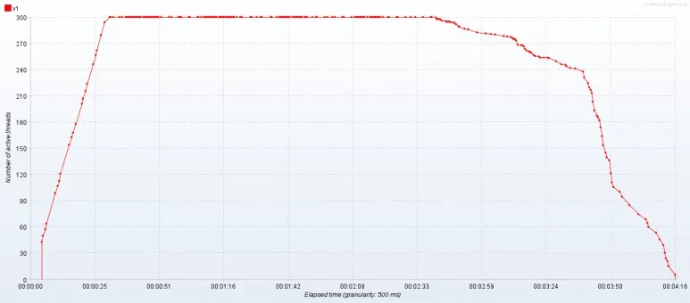

[V3]

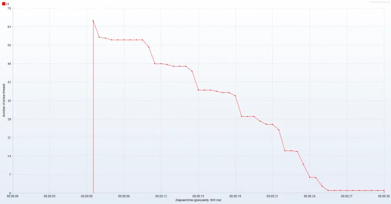

- 결과
    - V1 : 초기 부하는 잘 견뎠으나 상단에 유지되는 동안 병목 또는 자원 부족으로 인하여 높은 응답 지연 및 실패 발생
    - V3 : 사용자가 빠르게 처리되고 병목 없이 종료

### 4. 단위 시간(1초) 동안 서버가 받은 요청 수

[V1]

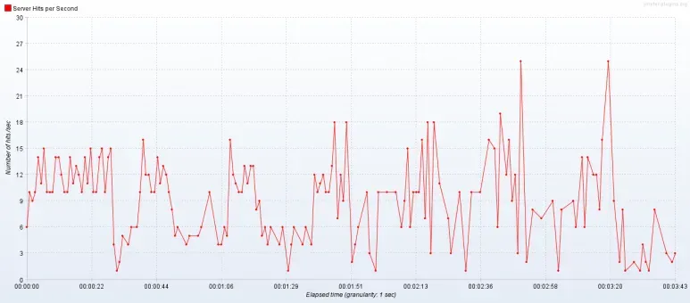

[V3]

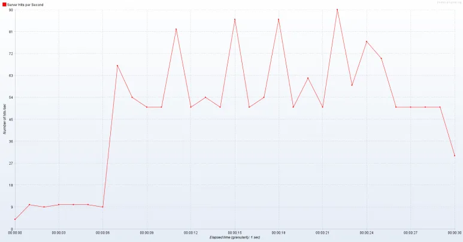

- 결과
    - V1 : 전반적으로 일관성과 처리량 모두 낮음
    - V3 : 처리량 매우 높고 안정적임

[총합 보고서]


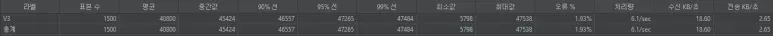

### nGrinder 테스트

- 테스트 조건: 동시 사용자 25명이 각각 1분 동안 가능한 한 많은 요청을 반복해서 보냄

**결과 요약**:

| 지표 | 캐시 미적용 | 캐시 적용 | 개선 효과 |
| --- | --- | --- | --- |
| TPS(초당 처리 건수) | 13.1 | 900.2 | 약 69배 증가 |
| 최대 TPS | 15.5 | 1,185.5 | 약 76배 증가 |
| 평균 응답 시간 | 1,867.95ms | 22.85ms | 약 82배 빨라짐 |
| 총 요청 수 | 606건 | 41,686건 | 약 69배 증가 |
| 성공률 | 100% | 100% | 동일 |
| 에러 발생 | 0건 | 0건 | 동일 |
| 테스트 시간 | 1분 | 1분 | 동일 |

**핵심 요점:**

- 캐시를 적용하니 처리 성능이 69~76배 이상 향상됐고, 응답 속도도 평균 82배 빨라짐
- 요청 성공률과 에러율은 그대로(둘 다 100% 성공, 에러 없음)

[캐시가 없을 경우]

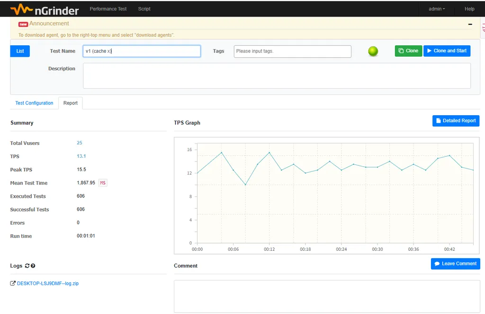

[캐시가 있을 경우]

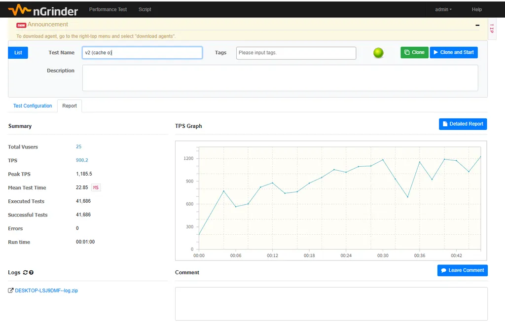

[성능 비교 결과]

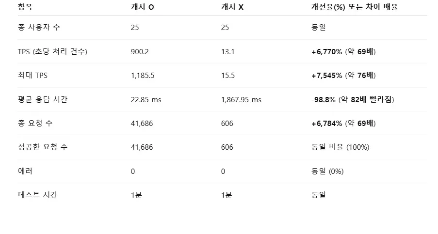


## 🔍 검색 트렌드 집계 시스템

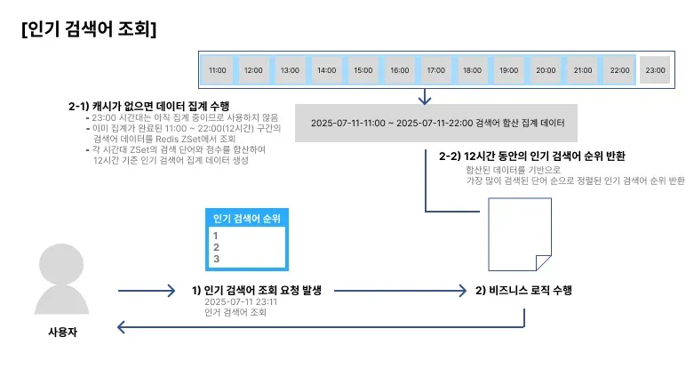

### 검색어 저장 방식 (AOP 기반)

- **조건**: 숙소 검색 결과가 성공적으로 반환된 경우에만 저장
- **동작**: 검색어를 공백 기준으로 **단어 분리 → Redis ZSet에 저장**
- **저장 구조**:
    
    ```
    Key   : search:{yyyy-MM-dd-HH}:00 (현재 날짜 + 시간대)
    Value : 단어
    Score : 검색 횟수 (검색 할 때마다 +1씩 증가)
    ```
    
    **예시**:
    
    ```
    [2025-07-15 14:20] "제주도 바다" 검색 
    → Key: search:2025-07-15-14:00 
    → Value: {"제주도": 1, "바다": 1}
    
    [2025-07-15 14:25] "제주도" 다시 검색
    → 같은 Key에 "제주도"의 score +1 
    → 최종: {"제주도": 2, "바다": 1}
    ```
    

### 인기 검색어 집계 (슬라이딩 윈도우)

- **범위**: 현재 시각 제외, **12시간 전 ~ 1시간 전까지**의 ZSet 합산
- **방식**: 시간대별 Key 12개를 **ZUNIONSTORE**로 병합 → TOP 10 추출

### 현재 시간 제외 이유

- 현재 시간대는 **실시간으로 검색어가 계속 들어오는 중**
- 이 시간대까지 포함해 집계하려면 **요청마다 실시간 재계산이 필요**
    
    → **Redis ZSet 병합 연산(ZUNIONSTORE)은 비용이 크고 성능 저하 가능**
    

### 성능 최적화 전략

- **집계가 완료된 과거 시간대**(12시간 전 ~ 1시간 전)의 데이터를 대상으로만 합산
- 집계 결과는 TTL 1시간으로 Redis에 캐시되며, 이후 요청 시 재계산 없이 사용
- 실시간 집계 비용을 줄이면서도 최신 트렌드 반영 가능


## ⏳ 동시성 제어 문제

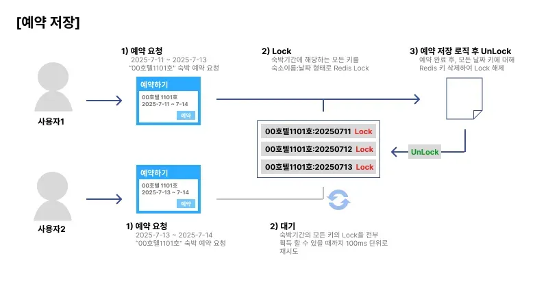

- 문제점: 같은 숙소, 같은 날짜에 여러 사용자가 동시 예약 시 중복 예약이 발생할 수 있음
- 해결책: 분산 락 적용
- 선택 이유:
    - 분산 락은 대규모 트래픽에 더 적합
    - 비관적, 낙관적 락의 단점 보완 가능
- 구현: Lettuce 기반 Spin Lock으로 직접 락 제어

### 세부 구현 내용

- **동시성 제어 구현 전 → 중복 예약 발생**

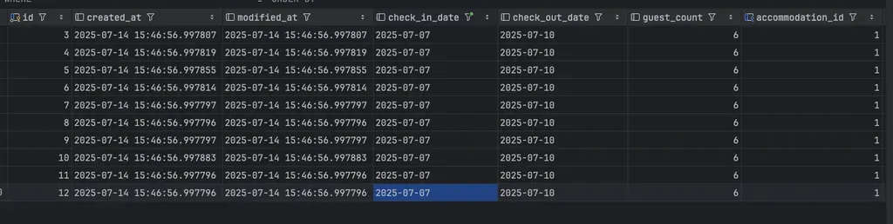
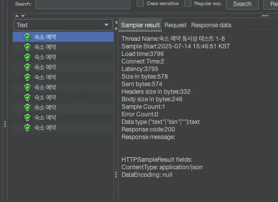

- **동시성 제어 구현 후 → 10명의 사용자가 동시 접속 시, 한명만 숙소 예약 가능**
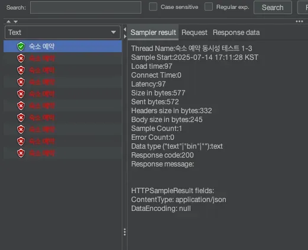
